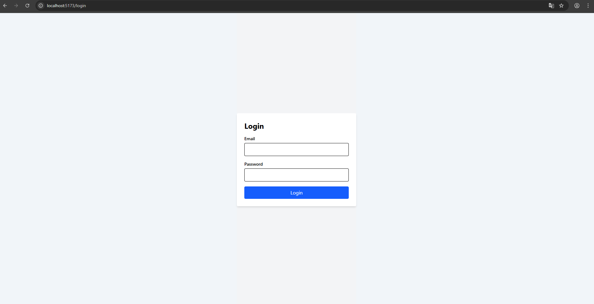
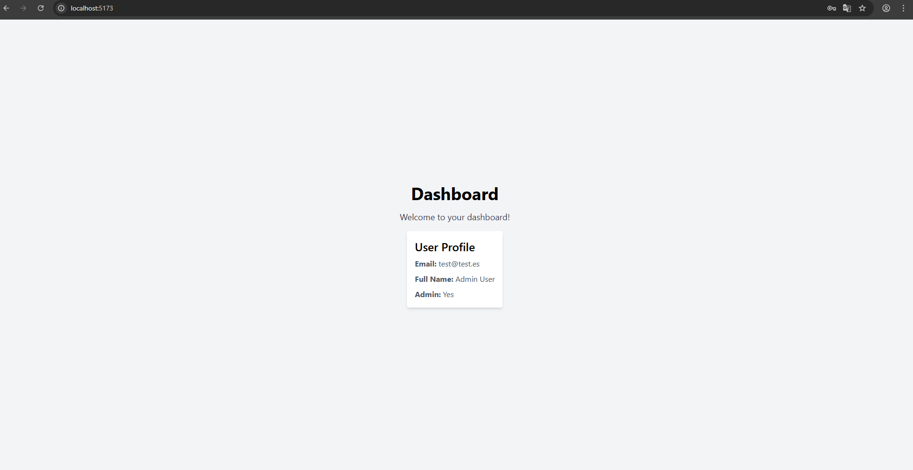

# FastAPI React Example - Frontend

This is a FastAPI frontend application that serves as a companion to the FastAPI backend example. It provides a user interface for authentication and interaction with the backend API.

## Key Features

- User authentication with JWT tokens.
- Global state management using Zustand.
- API integration with Axios.
- Axios interceptors for token refresh and error handling.
- Responsive design with Tailwind CSS.
- Router system with React Router.
- Public and private routes.
- Error handling and loading states.
- User profile fetching from the backend.

## Installation

1. Clone the repository.
2. Install the environment with `npm install`.
3. Start the FastAPI development server:
   ```bash
   npm run dev
   ```

## Images





## Backend Repository

For the backend FastAPI application, visit the [FastAPI React Example Backend](https://github.com/M4RC0Sx/FastAPI-React-Example-Backend).
